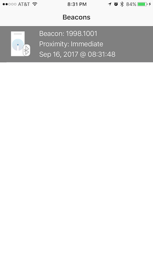

Kontakt Beacon Sample
===========

Swift sample app that detects [Kontakt](https://kontakt.io/) beacons. App was tested with Kontakt card beacons using Kontakt SDK.

## Getting Started
Open workspace, change UUID in ViewController.swift, run the app! That's it - start detecting beacons!

## CocoaPod referenced
KontaktSDK ~> 1.4.2

Whisper ~> 5.0.0

## App Screenshots

