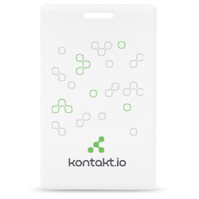
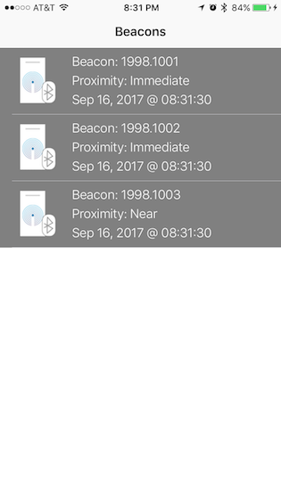
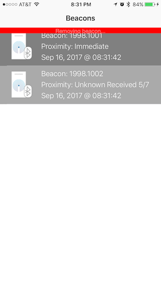

Kontakt Beacon Sample
===========

Swift sample app that detects [Kontakt](https://kontakt.io/) beacons. App was tested with Kontakt card beacons using Kontakt SDK.

## Getting Started

1. Open workspace, change `COGNATIVE_SERVICE_API_KEY` in AnnotatedPictureViewController.swift

2. Open project file and set Team under Signing

3. That's it! Run the app and start detecting beacons!

## CocoaPod referenced

* [KontaktSDK](https://cocoapods.org/pods/KontaktSDK) ~> 1.4.2
* [Whisper](https://cocoapods.org/pods/Whisper) ~> 5.0.0

## App Screenshots

