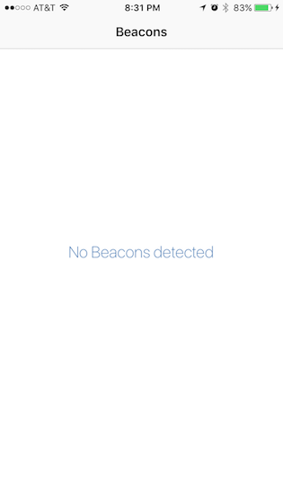

Kontakt Beacon Sample
===========

Sample Swift app that detects [Kontakt](https://kontakt.io/) beacons. App was tested with Kontakt card beacons using Kontakt SDK.

## Getting Started

1. Open workspace, change `ProximityUuid` in BeaconTableViewController.swift

2. Open project file and set Team under Signing

3. That's it! Run the app and start detecting beacons!

## CocoaPod referenced

* [KontaktSDK](https://cocoapods.org/pods/KontaktSDK) ~> 1.4.2
* [Whisper](https://cocoapods.org/pods/Whisper) ~> 5.0.0

## Leverages

* Kontakt SDK which leverages Core Location

## App Screenshots

 
